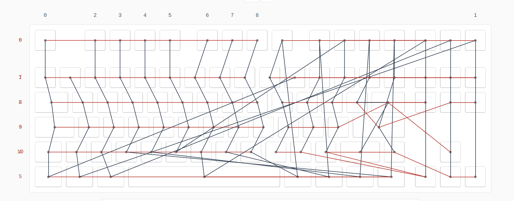
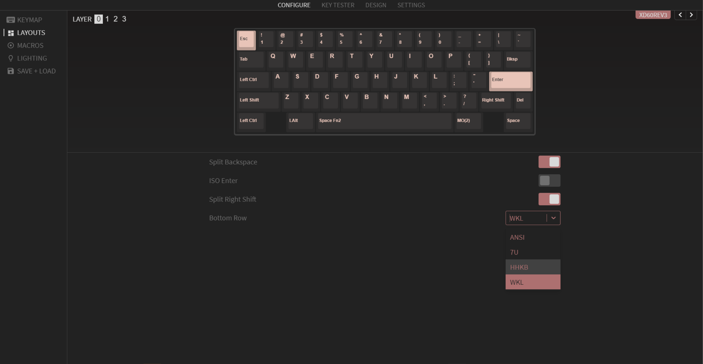

# keyboard_miscellaneous

## first

Use QMK_toolbox to Flash firmware [QMK_toolbox](https://qmk.fm/zh-cn/)

## second

Download Via from [there](https://github.com/the-via/releases/releases/latest) and install.

## third

Open via and import json file for via.

## NOTICE

- Version for SAM‘s S80

- Version for xd60：ver3 
    - VIA supported layout：